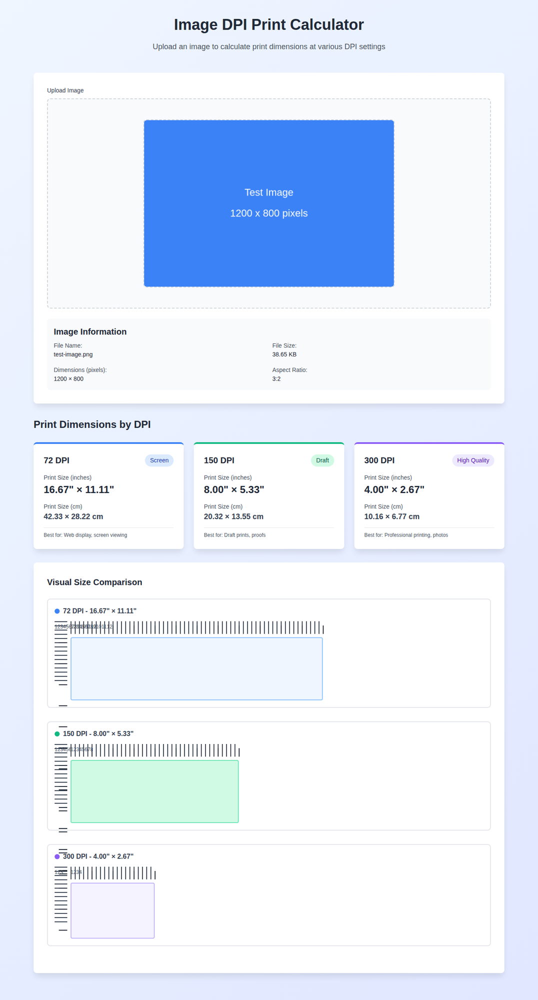

# Image DPI Print Calculator

A web utility that lets users upload an image and calculates print dimensions at multiple DPI (Dots Per Inch) values. The calculator shows results visually with rulers and a beautiful, responsive layout.



## Features

- 📤 **Image Upload**: Click to upload or drag and drop images (PNG, JPG, GIF)
- 📊 **Multi-DPI Calculations**: Automatically calculates print dimensions at 72, 150, and 300 DPI
- 📏 **Visual Rulers**: Interactive ruler graphics showing inch measurements
- 🎨 **Beautiful Design**: Modern, responsive design with gradient backgrounds and card layouts
- 📱 **Responsive**: Works perfectly on desktop, tablet, and mobile devices
- 📐 **Dual Units**: Shows print sizes in both inches and centimeters
- ℹ️ **Image Details**: Displays file name, size, dimensions, and aspect ratio

## DPI Levels

- **72 DPI** - Screen quality, best for web display and screen viewing
- **150 DPI** - Draft quality, suitable for draft prints and proofs
- **300 DPI** - High quality, professional standard for printing and photos

## How to Use

1. Open `index.html` in a web browser
2. Click the upload area or drag and drop an image file
3. View the calculated print dimensions for each DPI setting
4. Compare visual size representations with rulers

## Technical Details

The calculator uses a simple formula:
```
Print Size (inches) = Image Width/Height (pixels) ÷ DPI
Print Size (cm) = Print Size (inches) × 2.54
```

## Screenshots

### Desktop View
Upload screen and calculation results with visual rulers showing relative print sizes at different DPI values.

### Mobile View
Fully responsive design that adapts to smaller screens with stacked layout.

## Browser Compatibility

Works in all modern browsers that support:
- HTML5 File API
- Canvas API
- CSS3 Flexbox and Grid
- ES6 JavaScript

## License

This project is licensed under the MIT License - see the [LICENSE](LICENSE) file for details.
